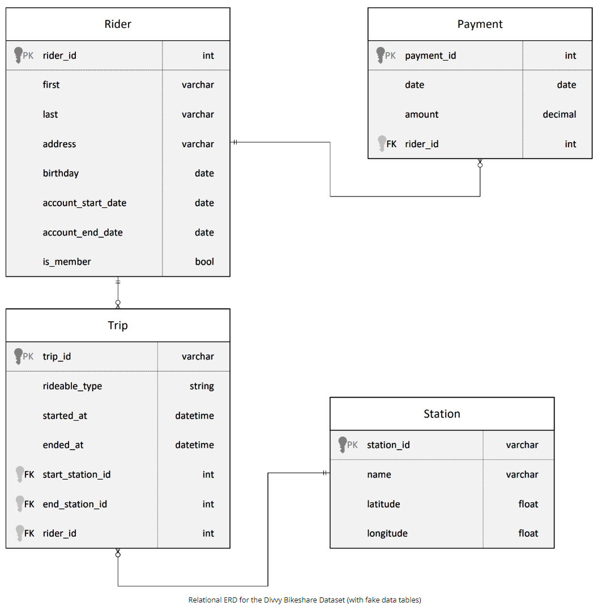
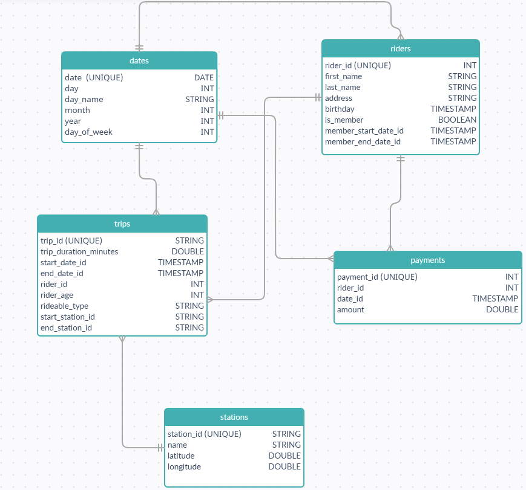
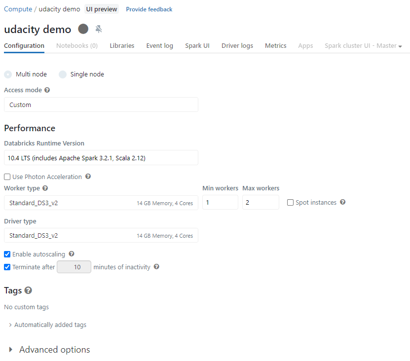
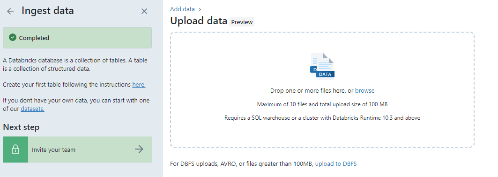
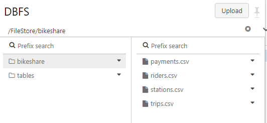
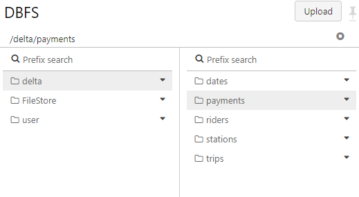
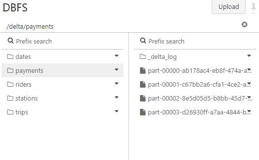
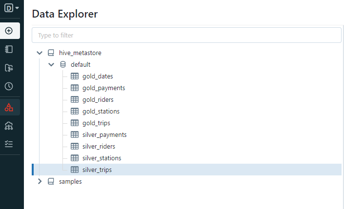
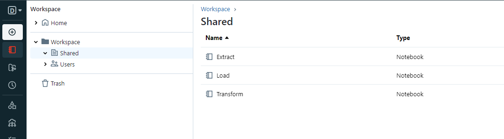

# Building-an-Azure-Data-Lake-for-Bike-Share-Data-Analytics
Udacity Nanodegree project: Building an Azure Data Lake for Bike Share Data Analytics

## Project Overview

DIn this project, you'll build a data lake solution for Divvy bikeshare.

Divvy is a bike sharing program in Chicago, Illinois USA that allows riders to purchase a pass at a kiosk or use a mobile application to unlock a bike at stations around the city and use the bike for a specified amount of time. The bikes can be returned to the same station or to another station. The City of Chicago makes the anonymized bike trip data publicly available for projects like this where we can analyze the data.

Since the data from Divvy are anonymous, we have generated fake rider and account profiles along with fake payment data to go along with the data from Divvy. The dataset looks like this:

The goal of this project is to develop a data lake solution using Azure Databricks using a lake house architecture. You will:

 - Design a star schema based on the business outcomes listed below;
 - Import the data into Azure Databricks using Delta Lake to create a Bronze data store;
 - Create a gold data store in Delta Lake tables;
 - Transform the data into the star schema for a Gold data store

You'll need the [dataset](https://video.udacity-data.com/topher/2022/March/62420bb1_azure-data-lakehouse-projectdatafiles/azure-data-lakehouse-projectdatafiles.zip)

### The business outcomes you are designing for are as follows:

1. Analyze how much time is spent per ride
- Based on date and time factors such as day of week and time of day
- Based on which station is the starting and / or ending station
- Based on age of the rider at time of the ride
- Based on whether the rider is a member or a casual rider

2. Analyze how much money is spent
- Per month, quarter, year
- Per member, based on the age of the rider at account start

3. EXTRA CREDIT - Analyze how much money is spent per member
- Based on how many rides the rider averages per month
- Based on how many minutes the rider spends on a bike per month

Your submission will be assessed against this [rubric](https://review.udacity.com/#!/rubrics/4817/view)

## Task 1: Design a star schema

## Task 2: Azure Databricks creation

Hint: To view your DBFS files, enable the DBFS file browser in Databricks by going to Admin Console -> Workspace Settings -> Advanced

### Task 3: Import csv files to Databricks DBFS

Using the Databricks UI upload the csv files to DBFS

## Task 4: Import the data into Azure Databricks using Delta Lake to create a Bronze data store

You can find the code in the `Extract.ipynb` notebook. 

The entry to working with Delta Lake in Azure is through the Databricks workspace. Once you have created your workspace, you have access to Delta Lake, After we've created the Databricks workspace there are three more main tasks:

 - Ingest data into delta lake
 - Create and delete tables
 - Read and write data both to and from files as well as to and from tables

Here we will ingest data from the DBFS into Delta tables.

## Task 5: Create delta tables for a silver datastore

You can find the code in the `Load.ipynb` notebook. 

Here we create the silver data store by reading the deltas from the bronze store

## Task 6: Create delta tables for a gold datastore

You can find the code in the `Transform.ipynb` notebook. 

We create and populate the star schema design. We create the fact and dimension tables according to design

